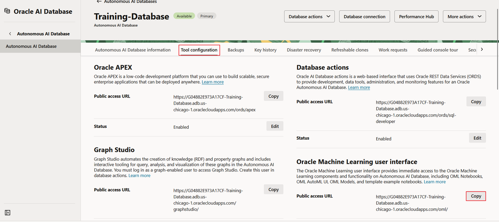
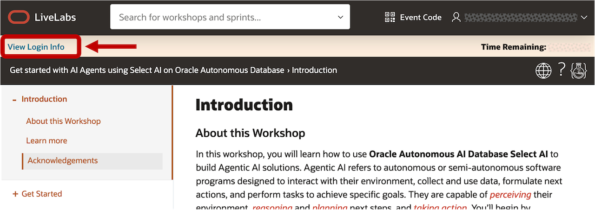
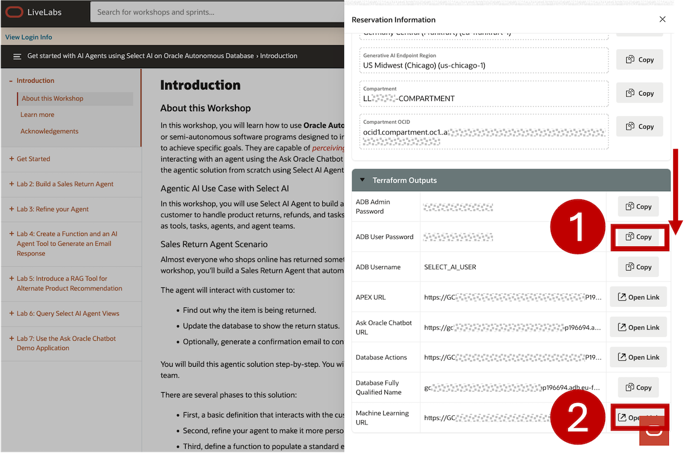
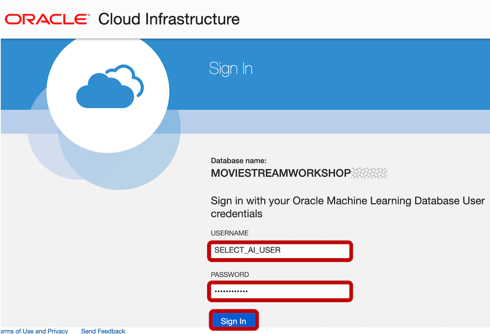
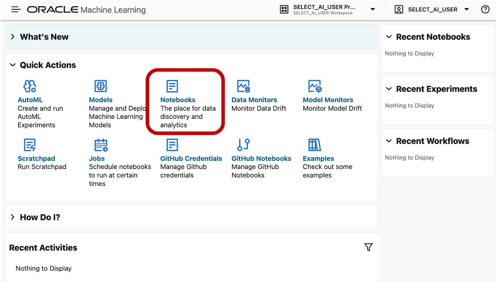
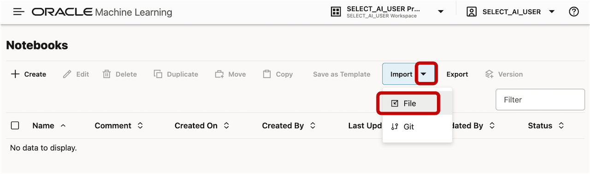
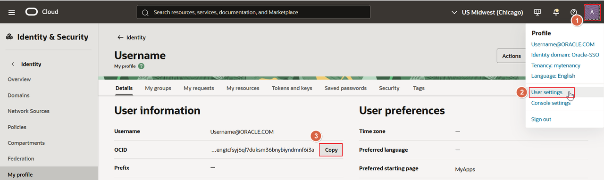
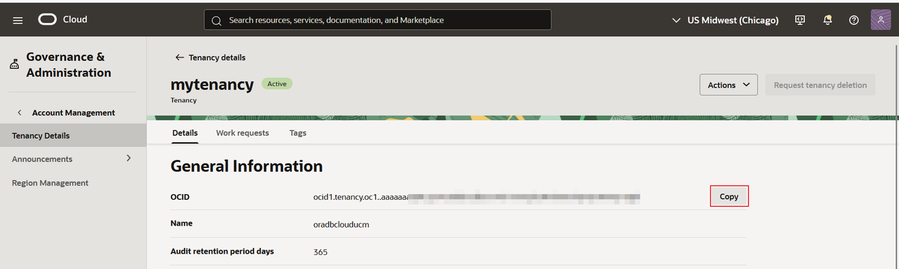
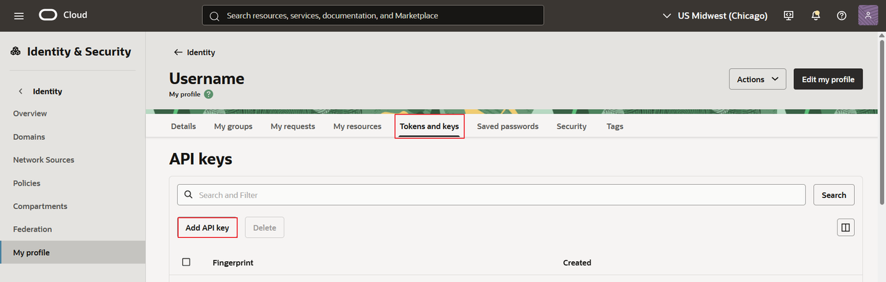

# Build a Travel Agency Supervisor Agent

## Introduction

In this lab, you'll turn a common travel agency workflow - changing a customer's reservation - into an agentic workflow using Oracle Autonomous AI Database Select AI. The agent team will converse with you, the traveler, identify your reservation, find hotel and rental-car alternatives, and update the reservation after you confirm a change.

A Select AI Supervisor Agent receives each request and delegates work to specialists for reservation verification, hotel alternatives, car alternatives, and confirmed changes. Each worker handles a focused responsibility. The supervisor gathers the results and returns one coordinated response to the traveler.

Estimated Time: 60 minutes

### Objectives

In this lab, you will:

* Download and import the Travel Reservation Supervisor Agent Notebook into Oracle Machine Learning Notebooks.
* Review sample travel data and create PL/SQL functions to look up reservations, find alternatives, and update a reservation.
* Create tools and tasks for reservation verification, hotel alternatives, car alternatives, and confirmed changes.
* Configure an AI profile and define four specialist agents and a supervisor agent.
* Create an agent team and interact with it using natural language on the SQL command line.
* Use the `DBMS_CLOUD_AI_AGENT.RUN_TEAM` function to run a multi-step interaction with an explicit conversation ID.
* Verify the reservation change and inspect task history to follow the supervisor's delegation path.

### Prerequisites

<if type="tenancy">

* Access to the Oracle Machine Learning Notebooks interface for your Autonomous AI Database.
* A database user with permission to create tables, PL/SQL functions, and packages, and sufficient tablespace quota for the sample data.
* The following package grants, run as ADMIN once. Replace `ADB_USER` with your database user name:

```sql
<copy>
GRANT EXECUTE ON DBMS_CLOUD_AI TO ADB_USER;
GRANT EXECUTE ON DBMS_CLOUD_AI_AGENT TO ADB_USER;
GRANT EXECUTE ON DBMS_CLOUD TO ADB_USER;
</copy>
```

* Access to OCI Generative AI, including the required IAM policies and database network access for the model used in the AI profile.
* Download the OML notebook to a local folder and follow Task 1 to import it:

    <a href="https://adwc4pm.objectstorage.us-ashburn-1.oci.customer-oci.com/p/RKeIvXEZQZZI9-pBlrh8xLr6S-Y5i3jrww3afpGhWpZU2v-64CdcVp8KM0cznCs8/n/adwc4pm/b/oaiw25-select-ai-agent-notebook/o/SelectAI4SQL%20-%20Travel%20Reservation%20Supervisor%20Agent.dsnb" class="tryit-button">Download Notebook</a>

</if>

<if type="sandbox">

* Access to the LiveLabs reservation login information for this workshop.
* Use the supplied database user and the preconfigured **AI_CREDENTIAL** credential.
* Download the OML notebook to a local folder and follow Task 1 to import it.

    <a href="https://adwc4pm.objectstorage.us-ashburn-1.oci.customer-oci.com/p/RKeIvXEZQZZI9-pBlrh8xLr6S-Y5i3jrww3afpGhWpZU2v-64CdcVp8KM0cznCs8/n/adwc4pm/b/oaiw25-select-ai-agent-notebook/o/SelectAI4SQL%20-%20Travel%20Reservation%20Supervisor%20Agent.dsnb" class="tryit-button">Download Notebook</a>

</if>

The code blocks below retain the notebook's `%script` and `%sql` interpreter directives. Run the existing paragraphs in order. If you paste a block into a new OML paragraph, include its directive once. When using a SQL client outside OML, omit that first line.

## Task 1: Download and Import the Provided Notebook into OML

Oracle provides a ready-to-use OML notebook that walks through the complete setup of the **Travel Reservation Supervisor Agent**, including sample data, functions, tools, tasks, agents, a team, and customer interactions. In this task, you will download **SelectAI4SQL - Travel Reservation Supervisor Agent.dsnb** and import it into OML.

1. Download the notebook to a local folder:

    <a href="https://adwc4pm.objectstorage.us-ashburn-1.oci.customer-oci.com/p/RKeIvXEZQZZI9-pBlrh8xLr6S-Y5i3jrww3afpGhWpZU2v-64CdcVp8KM0cznCs8/n/adwc4pm/b/oaiw25-select-ai-agent-notebook/o/SelectAI4SQL%20-%20Travel%20Reservation%20Supervisor%20Agent.dsnb" class="tryit-button">Download Notebook</a>

<if type="tenancy">

2. To access the Oracle Machine Learning sign-in page, go to your Autonomous AI Database details page and click **Tool configuration**. In the **Oracle Machine Learning user interface** section, click **Copy**, and paste the URL into your browser.

    

3. Enter your database user name and password, and click **Sign In**.

</if>

<if type="sandbox">

2. Click **View Login Info** on your LiveLabs reservation.

    

    Scroll down the login information. Copy the **ADB User password**, and click the button to open the **Oracle Machine Learning UI**.

    

3. Enter **SELECT\_AI\_USER**, paste the copied password, and click **Sign In**.

    

</if>

4. From the OML home page, click **Notebooks**.

    

5. On the Notebooks page, click **Import**, then **File**.

    

<if type="tenancy">

6. In the **Open** dialog, select **SelectAI4SQL - Travel Reservation Supervisor Agent.dsnb** from your download folder and click **Open**. If needed, select the file type that includes **.dsnb**. After the import succeeds, the notebook appears in the notebook list.

</if>

<if type="sandbox">

6. In the **Open** dialog, select **SelectAI4SQL - Travel Reservation Supervisor Agent.dsnb** from your download folder and click **Open**. If needed, select the file type that includes **.dsnb**. After the import succeeds, the notebook appears in the notebook list.

</if>

7. Click **SelectAI4SQL - Travel Reservation Supervisor Agent** to open the Notebook **Editor**. Read the opening Markdown paragraphs, including the agent concepts and travel scenario.

    An **agent** defines a role and AI profile. A **task** supplies instructions and tools. A **tool** calls a function to retrieve data or perform an action. An **agent team** brings the agent-task pairs together, and a **conversation** preserves the context of an interaction.

    Select AI Agent Framework uses the **ReAct** pattern (Reasoning + Acting): it evaluates a request, chooses a tool or asks for more information, interprets the result, and continues until it can respond. In this scenario, the supervisor selects the specialist needed for each part of the traveler's request.

    > **Note:** If a **User Action Required** message appears when you open the notebook, click **Allow Run**. Run paragraphs individually so you can review the setup and respond to the team during the conversation.

## Task 2: Create and Review the Travel Data

The sample data is small and self-contained. It includes hotel choices, rental-car choices, and current customer reservations. You will use Alex Morgan's Miami reservation, **TRV-48291**, for the customer interactions.

1. Run the paragraph that creates and populates `hotel_options`. Its opening blocks remove the three scenario tables if they already exist, so rerunning it resets the demonstration data.

    ```sql
    <copy>
    %script
    BEGIN
      EXECUTE IMMEDIATE 'DROP TABLE travel_reservations PURGE';
    EXCEPTION WHEN OTHERS THEN IF SQLCODE != -942 THEN RAISE; END IF;
    END;
    /
    BEGIN
      EXECUTE IMMEDIATE 'DROP TABLE car_rental_options PURGE';
    EXCEPTION WHEN OTHERS THEN IF SQLCODE != -942 THEN RAISE; END IF;
    END;
    /
    BEGIN
      EXECUTE IMMEDIATE 'DROP TABLE hotel_options PURGE';
    EXCEPTION WHEN OTHERS THEN IF SQLCODE != -942 THEN RAISE; END IF;
    END;
    /
    CREATE TABLE hotel_options (
      hotel_id NUMBER PRIMARY KEY,
      hotel_name VARCHAR2(100) NOT NULL,
      city VARCHAR2(60) NOT NULL,
      star_rating NUMBER(2,1),
      nightly_rate NUMBER(10,2),
      room_type VARCHAR2(40),
      available_rooms NUMBER,
      amenities VARCHAR2(300)
    );
    INSERT INTO hotel_options VALUES (101, 'Harbor View Hotel', 'Miami', 4.5, 245, 'Ocean King', 6, 'Pool, beach access, breakfast');
    INSERT INTO hotel_options VALUES (102, 'Brickell City Suites', 'Miami', 4.0, 189, 'Executive Queen', 12, 'Gym, breakfast, business center');
    INSERT INTO hotel_options VALUES (103, 'Central Park Lodge', 'New York', 4.5, 310, 'Deluxe King', 4, 'Park views, fitness center');
    INSERT INTO hotel_options VALUES (104, 'Hudson Boutique Hotel', 'New York', 4.0, 265, 'Classic Queen', 9, 'Restaurant, concierge');
    INSERT INTO hotel_options VALUES (105, 'Golden Gate Inn', 'San Francisco', 4.0, 275, 'Bay View King', 7, 'Breakfast, parking');
    COMMIT;
    
    COMMENT ON TABLE hotel_options IS 'Travel agency hotel inventory. available_rooms indicates current sample availability.';
    COMMENT ON COLUMN hotel_options.amenities IS 'Hotel amenities that can be used to recommend an alternative.';
    </copy>
    ```

2. Create and populate `car_rental_options`. Each option includes a city, vehicle class, daily rate, and sample availability.

    ```sql
    <copy>
    %script
    CREATE TABLE car_rental_options (
      car_option_id NUMBER PRIMARY KEY,
      provider_name VARCHAR2(100) NOT NULL,
      city VARCHAR2(60) NOT NULL,
      vehicle_class VARCHAR2(40) NOT NULL,
      daily_rate NUMBER(10,2),
      available_vehicles NUMBER,
      features VARCHAR2(300)
    );
    INSERT INTO car_rental_options VALUES (201, 'SunDrive Rentals', 'Miami', 'Midsize SUV', 82, 5, 'Automatic, unlimited mileage, child seat available');
    INSERT INTO car_rental_options VALUES (202, 'Coastal Car Hire', 'Miami', 'Convertible', 115, 3, 'Automatic, unlimited mileage');
    INSERT INTO car_rental_options VALUES (203, 'Metro Mobility', 'New York', 'Compact', 69, 11, 'Automatic, airport pickup');
    INSERT INTO car_rental_options VALUES (204, 'Liberty Auto', 'New York', 'Luxury Sedan', 138, 2, 'Automatic, GPS, airport pickup');
    INSERT INTO car_rental_options VALUES (205, 'Bay Wheels', 'San Francisco', 'Electric SUV', 105, 4, 'Automatic, charging included');
    COMMIT;
    
    COMMENT ON TABLE car_rental_options IS 'Travel agency car rental inventory. available_vehicles indicates current sample availability.';
    </copy>
    ```

3. Create and populate `travel_reservations`. Each reservation links a traveler and reservation code to hotel and car selections.

    ```sql
    <copy>
    %script
    CREATE TABLE travel_reservations (
      reservation_code VARCHAR2(12) PRIMARY KEY,
      customer_name VARCHAR2(100) NOT NULL,
      customer_email VARCHAR2(120),
      city VARCHAR2(60) NOT NULL,
      check_in_date DATE NOT NULL,
      check_out_date DATE NOT NULL,
      hotel_id NUMBER REFERENCES hotel_options(hotel_id),
      car_option_id NUMBER REFERENCES car_rental_options(car_option_id),
      traveler_count NUMBER DEFAULT 1,
      reservation_status VARCHAR2(30) NOT NULL,
      last_updated TIMESTAMP DEFAULT SYSTIMESTAMP
    );
    INSERT INTO travel_reservations VALUES ('TRV-48291', 'Alex Morgan', 'alex.morgan@example.com', 'Miami', DATE '2026-09-12', DATE '2026-09-16', 101, 201, 2, 'CONFIRMED', SYSTIMESTAMP);
    INSERT INTO travel_reservations VALUES ('TRV-59302', 'Priya Shah', 'priya.shah@example.com', 'New York', DATE '2026-10-04', DATE '2026-10-08', 103, 203, 1, 'CONFIRMED', SYSTIMESTAMP);
    INSERT INTO travel_reservations VALUES ('TRV-67184', 'Diego Ramos', 'diego.ramos@example.com', 'San Francisco', DATE '2026-11-18', DATE '2026-11-22', 105, 205, 3, 'CONFIRMED', SYSTIMESTAMP);
    INSERT INTO travel_reservations VALUES ('TRV-78415', 'Mei Lin', 'mei.lin@example.com', 'Miami', DATE '2026-09-20', DATE '2026-09-24', 102, NULL, 2, 'CONFIRMED', SYSTIMESTAMP);
    COMMIT;
    
    COMMENT ON TABLE travel_reservations IS 'Current travel-agency customer reservations. Use customer name and reservation code to identify a reservation.';
    COMMENT ON COLUMN travel_reservations.reservation_status IS 'CONFIRMED or CANCELLED in this demonstration.';
    </copy>
    ```

4. View the reservations with their hotel and car details.

    ```sql
    <copy>
    %sql
    SELECT r.reservation_code, r.customer_name, r.city, r.check_in_date, r.check_out_date,
           h.hotel_name, c.provider_name || ' - ' || c.vehicle_class AS car_rental,
           r.reservation_status
    FROM travel_reservations r
    LEFT JOIN hotel_options h ON h.hotel_id = r.hotel_id
    LEFT JOIN car_rental_options c ON c.car_option_id = r.car_option_id
    ORDER BY r.reservation_code;
    </copy>
    ```

    **Result:** The query returns four reservations. Alex Morgan starts with **Harbor View Hotel** and **SunDrive Rentals - Midsize SUV** in Miami. The dates and inventory counts are fixed sample data; the functions do not check availability by travel date or decrement inventory when a reservation changes.

## Task 3: Create the Travel Reservation Functions

The workers call small PL/SQL functions to retrieve data and apply a change. The lookup uses the traveler name and reservation code. The update function checks for a confirmed reservation and validates the selected inventory before changing it.

1. Create `get_travel_reservation`. It returns the matching reservation details or a message when the name and reservation code do not match.

    ```sql
    <copy>
    %script
    CREATE OR REPLACE FUNCTION get_travel_reservation (
      p_customer_name IN VARCHAR2,
      p_reservation_code IN VARCHAR2
    ) RETURN CLOB IS
      l_result CLOB;
    BEGIN
      SELECT 'Reservation ' || r.reservation_code || ': traveler=' || r.customer_name ||
             ', city=' || r.city || ', stay=' || TO_CHAR(r.check_in_date, 'YYYY-MM-DD') ||
             ' to ' || TO_CHAR(r.check_out_date, 'YYYY-MM-DD') ||
             ', hotel=' || NVL(h.hotel_name, 'none') ||
             ', car=' || NVL(c.provider_name || ' ' || c.vehicle_class, 'none') ||
             ', status=' || r.reservation_status
        INTO l_result
        FROM travel_reservations r
        LEFT JOIN hotel_options h ON h.hotel_id = r.hotel_id
        LEFT JOIN car_rental_options c ON c.car_option_id = r.car_option_id
       WHERE UPPER(r.customer_name) = UPPER(TRIM(p_customer_name))
         AND UPPER(r.reservation_code) = UPPER(TRIM(p_reservation_code));
      RETURN l_result;
    EXCEPTION
      WHEN NO_DATA_FOUND THEN
        RETURN 'No reservation matched that customer name and reservation code.';
    END;
    /
    </copy>
    ```

2. Create `find_hotel_alternatives` and `find_car_alternatives`. Both search available sample inventory in the requested city. Hotel searches can use a maximum nightly rate, and car searches can filter by vehicle class.

    ```sql
    <copy>
    %script
    CREATE OR REPLACE FUNCTION find_hotel_alternatives (
      p_city IN VARCHAR2,
      p_max_nightly_rate IN NUMBER DEFAULT NULL
    ) RETURN CLOB IS
      l_result CLOB := EMPTY_CLOB();
    BEGIN
      DBMS_LOB.CREATETEMPORARY(l_result, TRUE);
      FOR rec IN (SELECT hotel_id, hotel_name, star_rating, nightly_rate, room_type, amenities
                    FROM hotel_options
                   WHERE UPPER(city) = UPPER(TRIM(p_city))
                     AND available_rooms > 0
                     AND (p_max_nightly_rate IS NULL OR nightly_rate <= p_max_nightly_rate)
                   ORDER BY nightly_rate, star_rating DESC) LOOP
        DBMS_LOB.APPEND(l_result, 'Hotel ID ' || rec.hotel_id || ': ' || rec.hotel_name ||
          ' (' || rec.star_rating || ' stars), ' || rec.room_type || ', $' || rec.nightly_rate ||
          ' per night. Amenities: ' || rec.amenities || CHR(10));
      END LOOP;
      IF DBMS_LOB.GETLENGTH(l_result) = 0 THEN RETURN 'No available hotel alternatives matched the request.'; END IF;
      RETURN l_result;
    END;
    /
    CREATE OR REPLACE FUNCTION find_car_alternatives (
      p_city IN VARCHAR2,
      p_vehicle_class IN VARCHAR2 DEFAULT NULL
    ) RETURN CLOB IS
      l_result CLOB := EMPTY_CLOB();
    BEGIN
      DBMS_LOB.CREATETEMPORARY(l_result, TRUE);
      FOR rec IN (SELECT car_option_id, provider_name, vehicle_class, daily_rate, features
                    FROM car_rental_options
                   WHERE UPPER(city) = UPPER(TRIM(p_city))
                     AND available_vehicles > 0
                     AND (p_vehicle_class IS NULL OR UPPER(vehicle_class) LIKE '%' || UPPER(p_vehicle_class) || '%')
                   ORDER BY daily_rate) LOOP
        DBMS_LOB.APPEND(l_result, 'Car ID ' || rec.car_option_id || ': ' || rec.provider_name ||
          ' ' || rec.vehicle_class || ', $' || rec.daily_rate || ' per day. Features: ' || rec.features || CHR(10));
      END LOOP;
      IF DBMS_LOB.GETLENGTH(l_result) = 0 THEN RETURN 'No available car alternatives matched the request.'; END IF;
      RETURN l_result;
    END;
    /
    </copy>
    ```

3. Create `change_travel_reservation`. It checks the customer name, reservation code, reservation status, and selected options. It updates the hotel, car, or both, preserves any selection not supplied, and commits the change.

    ```sql
    <copy>
    %script
    CREATE OR REPLACE FUNCTION change_travel_reservation (
      p_customer_name IN VARCHAR2,
      p_reservation_code IN VARCHAR2,
      p_new_hotel_id IN NUMBER DEFAULT NULL,
      p_new_car_option_id IN NUMBER DEFAULT NULL
    ) RETURN CLOB IS
      l_count NUMBER;
      l_city travel_reservations.city%TYPE;
    BEGIN
      SELECT city INTO l_city
        FROM travel_reservations
       WHERE UPPER(customer_name) = UPPER(TRIM(p_customer_name))
         AND UPPER(reservation_code) = UPPER(TRIM(p_reservation_code))
         AND reservation_status = 'CONFIRMED';
      IF p_new_hotel_id IS NULL AND p_new_car_option_id IS NULL THEN
        RETURN 'No change was requested.';
      END IF;
      IF p_new_hotel_id IS NOT NULL THEN
        SELECT COUNT(*) INTO l_count FROM hotel_options
         WHERE hotel_id = p_new_hotel_id AND UPPER(city) = UPPER(l_city) AND available_rooms > 0;
        IF l_count = 0 THEN RETURN 'The requested hotel option is not available for this reservation city.'; END IF;
      END IF;
      IF p_new_car_option_id IS NOT NULL THEN
        SELECT COUNT(*) INTO l_count FROM car_rental_options
         WHERE car_option_id = p_new_car_option_id AND UPPER(city) = UPPER(l_city) AND available_vehicles > 0;
        IF l_count = 0 THEN RETURN 'The requested car option is not available for this reservation city.'; END IF;
      END IF;
      UPDATE travel_reservations
         SET hotel_id = NVL(p_new_hotel_id, hotel_id),
             car_option_id = NVL(p_new_car_option_id, car_option_id),
             last_updated = SYSTIMESTAMP
       WHERE UPPER(customer_name) = UPPER(TRIM(p_customer_name))
         AND UPPER(reservation_code) = UPPER(TRIM(p_reservation_code));
      COMMIT;
      RETURN 'Reservation ' || UPPER(TRIM(p_reservation_code)) || ' was updated successfully.';
    EXCEPTION
      WHEN NO_DATA_FOUND THEN
        RETURN 'No confirmed reservation matched that customer name and reservation code.';
    END;
    /
    </copy>
    ```

    The change task you define later instructs the worker to obtain explicit customer confirmation before calling this function. The function itself validates reservation and inventory data; it does not receive or independently validate a confirmation flag.

<if type="sandbox">

## Task 4: Check OCI Credentials

Because you are using an Oracle LiveLabs-provided sandbox environment, a credential named **AI_CREDENTIAL** is already defined for you. Leave the notebook's credential-creation paragraph disabled.

1. Run the following query and confirm that **AI_CREDENTIAL** is listed and enabled.

</if>

<if type="tenancy">

## Task 4: Create OCI Credentials

Before you create the AI profile, configure the OCI credential it will use. The notebook's credential-creation paragraph is disabled by default and contains placeholders. If **AI_CREDENTIAL** is already configured for this database user, skip its creation and verify it in step 6.

1. In the OCI Console, open the profile menu and select **User Settings**. Copy your **User OCID**.

    

2. Open **Tenancy** from the profile menu and copy the **Tenancy OCID**.

    

3. Under **User Settings**, open **Tokens and Keys** and add an API key, or use an existing key. If you generate a new key pair, download the private key and register the public key. Copy the **Fingerprint** from the configuration preview or API key entry.

    

4. Open the corresponding private key file in a text editor. Use its contents for the private-key placeholder in the next paragraph.

5. Enable the credential-creation paragraph only if needed. Replace all four placeholders with your OCI values and run it. This block replaces any existing credential named **AI_CREDENTIAL**. Remove private-key contents before exporting or sharing your notebook.

    ```sql
    <copy>
    %script
    -- DISABLED BY DEFAULT. Enable only when you need to create an OCI credential.
    BEGIN
      DBMS_CLOUD.DROP_CREDENTIAL(credential_name => 'AI_CREDENTIAL');
    EXCEPTION WHEN OTHERS THEN IF SQLCODE != -20004 THEN RAISE; END IF;
    END;
    /
    BEGIN
      DBMS_CLOUD.CREATE_CREDENTIAL(
        credential_name => 'AI_CREDENTIAL',
        user_ocid       => '<YOUR_USER_OCID>',
        tenancy_ocid    => '<YOUR_TENANCY_OCID>',
        private_key     => '<YOUR_PRIVATE_KEY_PEM>',
        fingerprint     => '<YOUR_API_KEY_FINGERPRINT>'
      );
    END;
    /
    </copy>
    ```

6. Confirm that the OCI credential named **AI_CREDENTIAL** is available and enabled for your user.

</if>

    ```sql
    <copy>
    %sql
    
    SELECT OWNER, CREDENTIAL_NAME, ENABLED FROM ALL_CREDENTIALS;
    </copy>
    ```

## Task 5: Create an AI Profile

The AI profile identifies the provider, credential, model, and generation settings used by the supervisor and all four workers. The notebook uses an OCI Generative AI model; substitute a model available in your region if needed.

1. Run the paragraph that creates **TRAVEL\_SUPERVISOR\_PROFILE** using **AI_CREDENTIAL**.

    ```sql
    <copy>
    %script
    BEGIN
      DBMS_CLOUD_AI.DROP_PROFILE(profile_name => 'TRAVEL_SUPERVISOR_PROFILE');
    EXCEPTION WHEN OTHERS THEN NULL;
    END;
    /
    BEGIN
      DBMS_CLOUD_AI.CREATE_PROFILE(
        profile_name => 'TRAVEL_SUPERVISOR_PROFILE',
        attributes => '{"provider":"oci",
                        "credential_name":"AI_CREDENTIAL",
                        "model":"xai.grok-4.20-reasoning",
                        "temperature":0,
                        "comments":true}',
        description => 'LLM profile for the travel reservation supervisor demonstration'
      );
    END;
    /
    </copy>
    ```

## Task 6: Create the Travel Tools

Tools allow agents to perform actions against the database. Each tool names a PL/SQL function and describes when it should be called. The supervisor delegates to workers; the database tools are assigned to worker tasks.

1. Create the four tools for reservation lookup, hotel search, car search, and reservation changes.

    ```sql
    <copy>
    %script
    BEGIN DBMS_CLOUD_AI_AGENT.DROP_TOOL('GET_TRAVEL_RESERVATION_TOOL'); EXCEPTION WHEN OTHERS THEN NULL; END;
    /
    BEGIN DBMS_CLOUD_AI_AGENT.DROP_TOOL('FIND_HOTEL_ALTERNATIVES_TOOL'); EXCEPTION WHEN OTHERS THEN NULL; END;
    /
    BEGIN DBMS_CLOUD_AI_AGENT.DROP_TOOL('FIND_CAR_ALTERNATIVES_TOOL'); EXCEPTION WHEN OTHERS THEN NULL; END;
    /
    BEGIN DBMS_CLOUD_AI_AGENT.DROP_TOOL('CHANGE_TRAVEL_RESERVATION_TOOL'); EXCEPTION WHEN OTHERS THEN NULL; END;
    /
    BEGIN
      DBMS_CLOUD_AI_AGENT.CREATE_TOOL(tool_name  => 'GET_TRAVEL_RESERVATION_TOOL',
        attributes => '{"instruction":"Retrieve one reservation only after customer name and reservation code are provided.","function":"GET_TRAVEL_RESERVATION"}',
        description => 'Looks up a current travel reservation.');
      DBMS_CLOUD_AI_AGENT.CREATE_TOOL(tool_name  => 'FIND_HOTEL_ALTERNATIVES_TOOL',
        attributes =>'{"instruction":"Find currently available hotels in the requested reservation city.","function":"FIND_HOTEL_ALTERNATIVES"}',
        description => 'Finds available hotel alternatives.');
      DBMS_CLOUD_AI_AGENT.CREATE_TOOL(tool_name  => 'FIND_CAR_ALTERNATIVES_TOOL',
        attributes =>'{"instruction":"Find currently available rental cars in the requested reservation city.","function":"FIND_CAR_ALTERNATIVES"}',
        description => 'Finds available rental-car alternatives.');
      DBMS_CLOUD_AI_AGENT.CREATE_TOOL(tool_name  => 'CHANGE_TRAVEL_RESERVATION_TOOL',
        attributes =>'{"instruction":"Changes hotel and/or car selections only after explicit customer confirmation.","function":"CHANGE_TRAVEL_RESERVATION"}',
        description => 'Updates an identified confirmed travel reservation.');
    END;
    /
    </copy>
    ```

2. Verify the tools by querying `USER_AI_AGENT_TOOLS`.

    ```sql
    <copy>
    %sql
    
    SELECT * FROM user_ai_agent_tools ORDER BY tool_name;
    </copy>
    ```

## Task 7: Create the Worker Tasks

A task supplies the instructions and tools an agent uses to perform an activity. Each travel task has only the tool it needs. The `enable_human_tool` setting allows the task to ask the traveler for missing information or confirmation.

1. Create the four worker tasks. Review how verification requires both name and reservation code, searches return option IDs without changing a reservation, and the change task requires explicit confirmation.

    ```sql
    <copy>
    %script
    BEGIN DBMS_CLOUD_AI_AGENT.DROP_TASK('VERIFY_RESERVATION_TASK'); EXCEPTION WHEN OTHERS THEN NULL; END;
    /
    BEGIN DBMS_CLOUD_AI_AGENT.DROP_TASK('HOTEL_ALTERNATIVES_TASK'); EXCEPTION WHEN OTHERS THEN NULL; END;
    /
    BEGIN DBMS_CLOUD_AI_AGENT.DROP_TASK('CAR_ALTERNATIVES_TASK'); EXCEPTION WHEN OTHERS THEN NULL; END;
    /
    BEGIN DBMS_CLOUD_AI_AGENT.DROP_TASK('CHANGE_RESERVATION_TASK'); EXCEPTION WHEN OTHERS THEN NULL; END;
    /
    BEGIN
      DBMS_CLOUD_AI_AGENT.CREATE_TASK('VERIFY_RESERVATION_TASK',
        '{"instruction":"Verify a travel reservation. Ask for both the customer name and reservation code if either is missing. When both are supplied, call GET_TRAVEL_RESERVATION_TOOL and clearly report the result.","tools":["GET_TRAVEL_RESERVATION_TOOL"],"enable_human_tool":true}');
      DBMS_CLOUD_AI_AGENT.CREATE_TASK('HOTEL_ALTERNATIVES_TASK',
        '{"instruction":"Recommend available hotel alternatives. Use the reservation city supplied in the delegated request. If city is absent, ask the customer for it. Call FIND_HOTEL_ALTERNATIVES_TOOL and return options with their hotel IDs. Do not change a reservation.","tools":["FIND_HOTEL_ALTERNATIVES_TOOL"],"enable_human_tool":true}');
      DBMS_CLOUD_AI_AGENT.CREATE_TASK('CAR_ALTERNATIVES_TASK',
        '{"instruction":"Recommend available rental-car alternatives. Use the reservation city supplied in the delegated request. If city is absent, ask the customer for it. Call FIND_CAR_ALTERNATIVES_TOOL and return options with their car IDs. Do not change a reservation.","tools":["FIND_CAR_ALTERNATIVES_TOOL"],"enable_human_tool":true}');
      DBMS_CLOUD_AI_AGENT.CREATE_TASK('CHANGE_RESERVATION_TASK',
        '{"instruction":"Change a confirmed reservation only when customer name, reservation code, selected hotel ID and/or car ID, and explicit confirmation are present. If confirmation is missing, summarize the proposed change and ask for confirmation. On confirmation call CHANGE_TRAVEL_RESERVATION_TOOL.","tools":["CHANGE_TRAVEL_RESERVATION_TOOL"],"enable_human_tool":true}');
    END;
    /
    </copy>
    ```

## Task 8: Define the Specialist Agents

An agent specifies its role and the AI profile it uses. You will create one specialist for each travel task, all using **TRAVEL\_SUPERVISOR\_PROFILE**.

1. Create **RESERVATION\_SPECIALIST**, **HOTEL\_SPECIALIST**, **CAR\_SPECIALIST**, and **CHANGE\_SPECIALIST**.

    ```sql
    <copy>
    %script
    BEGIN DBMS_CLOUD_AI_AGENT.DROP_AGENT('RESERVATION_SPECIALIST'); EXCEPTION WHEN OTHERS THEN NULL; END;
    /
    BEGIN DBMS_CLOUD_AI_AGENT.DROP_AGENT('HOTEL_SPECIALIST'); EXCEPTION WHEN OTHERS THEN NULL; END;
    /
    BEGIN DBMS_CLOUD_AI_AGENT.DROP_AGENT('CAR_SPECIALIST'); EXCEPTION WHEN OTHERS THEN NULL; END;
    /
    BEGIN DBMS_CLOUD_AI_AGENT.DROP_AGENT('CHANGE_SPECIALIST'); EXCEPTION WHEN OTHERS THEN NULL; END;
    /
    BEGIN
      DBMS_CLOUD_AI_AGENT.CREATE_AGENT('RESERVATION_SPECIALIST', '{"profile_name":"TRAVEL_SUPERVISOR_PROFILE","role":"You are a precise travel reservation verification specialist."}');
      DBMS_CLOUD_AI_AGENT.CREATE_AGENT('HOTEL_SPECIALIST', '{"profile_name":"TRAVEL_SUPERVISOR_PROFILE","role":"You are a helpful hotel alternatives specialist."}');
      DBMS_CLOUD_AI_AGENT.CREATE_AGENT('CAR_SPECIALIST', '{"profile_name":"TRAVEL_SUPERVISOR_PROFILE","role":"You are a rental-car alternatives specialist."}');
      DBMS_CLOUD_AI_AGENT.CREATE_AGENT('CHANGE_SPECIALIST', '{"profile_name":"TRAVEL_SUPERVISOR_PROFILE","role":"You are a careful reservation change specialist who never updates without confirmation."}');
    END;
    /
    </copy>
    ```

## Task 9: Create the Supervisor and Agent Team

The supervisor receives each traveler request and decides which specialist should handle the next subtask. Each worker has a separate conversation thread, so the supervisor must pass a self-contained request with the relevant name, reservation code, city, selected option, and confirmation.

The team uses `"process":"sequential"` , so one delegated subtask completes before the next begins. The supervisor chooses the workers and their order at runtime based on the traveler's request and earlier results. See [Select AI Supervisor Agent documentation](https://docs.oracle.com/en-us/iaas/autonomous-database-serverless/doc/supervisor-agent.html) for the orchestration details.

1. Create **TRAVEL\_SUPERVISOR** with `"supervisor":true`, then create **TRAVEL\_RESERVATION\_SUPERVISOR\_TEAM**. The team names the supervisor in `supervisor_agent` and lists the four worker agent-task pairs in `agents`.

    ```sql
    <copy>
    %script
    BEGIN DBMS_CLOUD_AI_AGENT.CLEAR_TEAM; EXCEPTION WHEN OTHERS THEN NULL; END;
    /
    BEGIN DBMS_CLOUD_AI_AGENT.DROP_TEAM('TRAVEL_RESERVATION_SUPERVISOR_TEAM'); EXCEPTION WHEN OTHERS THEN NULL; END;
    /
    BEGIN DBMS_CLOUD_AI_AGENT.DROP_AGENT('TRAVEL_SUPERVISOR'); EXCEPTION WHEN OTHERS THEN NULL; END;
    /
    BEGIN
      DBMS_CLOUD_AI_AGENT.CREATE_AGENT(
        agent_name => 'TRAVEL_SUPERVISOR',
        attributes => '{"profile_name":"TRAVEL_SUPERVISOR_PROFILE",
                        "supervisor":true,
                        "role":"You coordinate a travel reservation service. Interpret the customer intent, delegate self-contained requests to only the needed specialist, preserve customer name and reservation code across handoffs, request missing information, and return one clear final response. For an update, ensure a specialist has verified the reservation and the customer has explicitly confirmed the selected option."}'
      );
    END;
    /
    BEGIN
      DBMS_CLOUD_AI_AGENT.CREATE_TEAM(
        team_name => 'TRAVEL_RESERVATION_SUPERVISOR_TEAM',
        attributes => '{"process":"sequential",
                        "supervisor_agent":"TRAVEL_SUPERVISOR",
                        "agents":[{"name":"RESERVATION_SPECIALIST","task":"VERIFY_RESERVATION_TASK"},
                                  {"name":"HOTEL_SPECIALIST","task":"HOTEL_ALTERNATIVES_TASK"},
                                  {"name":"CAR_SPECIALIST","task":"CAR_ALTERNATIVES_TASK"},
                                  {"name":"CHANGE_SPECIALIST","task":"CHANGE_RESERVATION_TASK"}] }',
        description => 'Supervisor-led travel support team with dynamic specialist delegation'
      );
    END;
    /
    </copy>
    ```

## Task 10: Review the Agent Team Configuration

Before starting a conversation, inspect the tools, task instructions, agent roles, and team attributes you created.

1. Review the tool attributes and function mappings.

    ```sql
    <copy>
    %sql
    
     select * from USER_AI_AGENT_TOOL_ATTRIBUTES ORDER BY TRUNC(last_modified) DESC, tool_name;
    </copy>
    ```

2. Review the worker task attributes, including tools and human-input settings.

    ```sql
    <copy>
    %sql
    
    select * from USER_AI_AGENT_TASK_ATTRIBUTES ORDER BY TRUNC(last_modified) DESC, task_name;
    </copy>
    ```

3. List the agents.

    ```sql
    <copy>
    %sql
    
    SELECT * FROM user_ai_agents ORDER BY TRUNC(last_modified) DESC, agent_name;
    </copy>
    ```

4. Review the agent attributes, including the supervisor flag and shared AI profile.

    ```sql
    <copy>
    %sql
    
     select * from USER_AI_AGENT_ATTRIBUTES ORDER BY TRUNC(last_modified) DESC, agent_name;
    </copy>
    ```

5. Review the team attributes. Confirm the supervisor name, sequential process, and four worker agent-task pairs.

    ```sql
    <copy>
    %sql
    
     select * from USER_AI_AGENT_TEAM_ATTRIBUTES ORDER BY TRUNC(last_modified) DESC, agent_team_name;
    </copy>
    ```

## Task 11: Interact with the Travel Agency Supervisor Agent

Set the team for the current stateful session, then prefix each natural language prompt with `SELECT AI AGENT`. Run the following paragraphs in order and read each response before continuing. If the team requests clarification, answer in the same conversation. Response wording and the delegation path can vary.

1. Clear any current team and set **TRAVEL\_RESERVATION\_SUPERVISOR\_TEAM**. This starts the session conversation.

    ```sql
    <copy>
    %script
    BEGIN DBMS_CLOUD_AI_AGENT.CLEAR_TEAM; EXCEPTION WHEN OTHERS THEN NULL; END;
    /
    BEGIN
      DBMS_CLOUD_AI_AGENT.SET_TEAM('TRAVEL_RESERVATION_SUPERVISOR_TEAM');
    END;
    /
    </copy>
    ```

2. Identify yourself as Alex Morgan and provide your reservation code. The supervisor should use the reservation specialist to retrieve your Miami reservation.

    ```sql
    <copy>
    %script
    SELECT AI AGENT I need help with my Miami reservation. I am Alex Morgan and my reservation code is TRV-48291
    </copy>
    ```

3. Ask for hotel alternatives. The hotel specialist should return available Miami hotels and their IDs, including **Brickell City Suites (102)** at **$189 per night**.

    ```sql
    <copy>
    %sql
    
    SELECT AI AGENT My hotel is no longer suitable. What hotel alternatives do I have in Miami
    </copy>
    ```

4. Ask for rental-car choices before making any change. The car specialist should return the Miami options, including SunDrive Rentals and Coastal Car Hire.

    ```sql
    <copy>
    %sql
    
    SELECT AI AGENT Before changing anything, can you also show rental-car choices for this Miami trip
    </copy>
    ```

5. Request and explicitly confirm the change to Brickell City Suites. The change specialist should apply the selected hotel update.

    ```sql
    <copy>
    %sql
    SELECT AI AGENT Please change my hotel to Brickell City Suites in Miami. Yes, I confirm that change
    </copy>
    ```

## Task 12: Verify the Reservation and Delegation History

Check the stored reservation to confirm the outcome, then inspect the task history to see which specialists the supervisor used.

1. Query Alex Morgan's reservation.

    ```sql
    <copy>
    %sql
    
    SELECT r.reservation_code, r.customer_name, h.hotel_name, c.provider_name || ' - ' || c.vehicle_class AS car_rental, r.last_updated
    FROM travel_reservations r
    LEFT JOIN hotel_options h ON h.hotel_id = r.hotel_id
    LEFT JOIN car_rental_options c ON c.car_option_id = r.car_option_id
    WHERE r.reservation_code = 'TRV-48291';
    </copy>
    ```

    **Result:** After a successful change, **TRV-48291** shows **Brickell City Suites**. The car remains **SunDrive Rentals - Midsize SUV**, because you requested car alternatives without confirming a car change. If the hotel has not changed, review the team response and supply any requested confirmation in the same conversation.

2. Query the team's task execution history. Compare `TASK_NAME`, `AGENT_NAME`, and `STATE` for the recent executions. Use `TEAM_EXEC_ID` to distinguish requests and `START_DATE` to follow their order; the query displays the newest rows first.

    ```sql
    <copy>
    %sql
    SELECT team_exec_id, task_name, agent_name, state, start_date, end_date
    FROM user_ai_agent_task_history
    WHERE team_exec_id IN (SELECT team_exec_id FROM user_ai_agent_team_history WHERE team_name = 'TRAVEL_RESERVATION_SUPERVISOR_TEAM')
    ORDER BY start_date DESC;
    </copy>
    ```

    Look for reservation verification, hotel alternatives, car alternatives, and the confirmed change across the interaction. The supervisor selects only the workers needed for each request, so every request does not need to invoke all four tasks.

## Task 13: Use `DBMS_CLOUD_AI_AGENT.RUN_TEAM`

The `RUN_TEAM` function lets you use the team from PL/SQL and manage the conversation explicitly in an application. You will create a conversation ID and pass it with every request so the team can retain the interaction context. The function form used here returns the response, which you print with `DBMS_OUTPUT.PUT_LINE`.

This repeats the notebook's travel conversation using PL/SQL. If you completed Task 11, Alex's hotel is already Brickell City Suites. The final request selects that same hotel again; creating a new conversation does not reset the reservation data.

1. Create the `my_globals` package and a new conversation. Keep the following calls in the same OML session so the package variable retains the conversation ID. This paragraph replaces `my_globals` if a previous lab created it.

    ```sql
    <copy>
    %script
    
    CREATE OR REPLACE PACKAGE my_globals IS
      l_team_conv_id varchar2(4000);
    END my_globals;
    /
    -- Create conversation
    DECLARE
      l_team_conv_id varchar2(4000);
    BEGIN
      l_team_conv_id := DBMS_CLOUD_AI.create_conversation();
      my_globals.l_team_conv_id := l_team_conv_id;
      DBMS_OUTPUT.PUT_LINE('Created conversation with ID: ' || my_globals.l_team_conv_id);
    END;
    </copy>
    ```

2. Call `RUN_TEAM` with the traveler name and reservation code.

    ```sql
    <copy>
    %script
    
    DECLARE
      v_response VARCHAR2(4000);
    BEGIN
      v_response :=  DBMS_CLOUD_AI_AGENT.RUN_TEAM(
        team_name   => 'TRAVEL_RESERVATION_SUPERVISOR_TEAM',
        user_prompt => 'I need help with my Miami reservation. I am Alex Morgan and my reservation code is TRV-48291',
        params      => '{"conversation_id": "' || my_globals.l_team_conv_id || '"}'
      );
      DBMS_OUTPUT.PUT_LINE(v_response);
    END;
    </copy>
    ```

3. Request Miami hotel alternatives using the same conversation ID.

    ```sql
    <copy>
    %script
    
    DECLARE
      v_response VARCHAR2(4000);
    BEGIN
      v_response :=  DBMS_CLOUD_AI_AGENT.RUN_TEAM(
        team_name   => 'TRAVEL_RESERVATION_SUPERVISOR_TEAM',
        user_prompt => 'My hotel is no longer suitable. What hotel alternatives do I have in Miami',
        params      => '{"conversation_id": "' || my_globals.l_team_conv_id || '"}'
      );
      DBMS_OUTPUT.PUT_LINE(v_response);
    END;
    </copy>
    ```

4. Request rental-car alternatives without changing the reservation.

    ```sql
    <copy>
    %script
    
    DECLARE
      v_response VARCHAR2(4000);
    BEGIN
      v_response :=  DBMS_CLOUD_AI_AGENT.RUN_TEAM(
        team_name   => 'TRAVEL_RESERVATION_SUPERVISOR_TEAM',
        user_prompt => 'Before changing anything, can you also show rental-car choices for this Miami trip',
        params      => '{"conversation_id": "' || my_globals.l_team_conv_id || '"}'
      );
      DBMS_OUTPUT.PUT_LINE(v_response);
    END;
    </copy>
    ```

5. Confirm the hotel selection. If the team asks a follow-up question, use another `RUN_TEAM` call with that answer and the same conversation ID.

    ```sql
    <copy>
    %script
    
    DECLARE
      v_response VARCHAR2(4000);
    BEGIN
      v_response :=  DBMS_CLOUD_AI_AGENT.RUN_TEAM(
        team_name   => 'TRAVEL_RESERVATION_SUPERVISOR_TEAM',
        user_prompt => 'Please change my hotel to Brickell City Suites in Miami. Yes, I confirm that change',
        params      => '{"conversation_id": "' || my_globals.l_team_conv_id || '"}'
      );
      DBMS_OUTPUT.PUT_LINE(v_response);
    END;
    </copy>
    ```

6. Verify the stored hotel and car selections after the PL/SQL interaction.

    ```sql
    <copy>
    %sql
    
    SELECT r.reservation_code, r.customer_name, h.hotel_name, c.provider_name || ' - ' || c.vehicle_class AS car_rental, r.last_updated
    FROM travel_reservations r
    LEFT JOIN hotel_options h ON h.hotel_id = r.hotel_id
    LEFT JOIN car_rental_options c ON c.car_option_id = r.car_option_id
    WHERE r.reservation_code = 'TRV-48291';
    </copy>
    ```

7. Inspect task history again. Review the latest executions to follow the worker handoffs for this conversation.

    ```sql
    <copy>
    %sql
    SELECT team_exec_id, task_name, agent_name, state, start_date, end_date
    FROM user_ai_agent_task_history
    WHERE team_exec_id IN (SELECT team_exec_id FROM user_ai_agent_team_history WHERE team_name = 'TRAVEL_RESERVATION_SUPERVISOR_TEAM')
    ORDER BY start_date DESC;
    </copy>
    ```

You may now proceed to the next lab.

## Learn More

* [Select AI Supervisor Agent documentation](https://docs.oracle.com/en-us/iaas/autonomous-database-serverless/doc/supervisor-agent.html)
* [How to Use Select AI Supervisor Agent Teams](https://docs.oracle.com/en-us/iaas/autonomous-database-serverless/doc/how-to-use-select-ai-supervisor-agent-teams.html)
* [OML Notebooks](https://docs.oracle.com/en/database/oracle/machine-learning/oml-notebooks/index.html)
* [Select AI](https://docs.oracle.com/en/cloud/paas/autonomous-database/serverless/adbsb/select-ai.html)
* [`DBMS_CLOUD_AI_AGENT` Package](https://docs.oracle.com/en/cloud/paas/autonomous-database/serverless/adbsb/dbms-cloud-ai-agent-package.html)
* [`DBMS_CLOUD_AI` Package](https://docs.oracle.com/en/cloud/paas/autonomous-database/serverless/adbsb/dbms-cloud-ai-package.html)

## Acknowledgements

* **Author:** Marcos Arancibia, Lead Principal Product Manager
* **Contributor:** Mark Hornick, Senior Dir of ML and AI Product Management ; Sherry LaMonica, Lead Principal Product Manager
* **Last Updated By/Date:** Marcos Arancibia, September 2026

Copyright (c) 2026 Oracle Corporation.

Permission is granted to copy, distribute and/or modify this document
under the terms of the GNU Free Documentation License, Version 1.3
or any later version published by the Free Software Foundation;
with no Invariant Sections, no Front-Cover Texts, and no Back-Cover Texts.
A copy of the license is included in the section entitled [GNU Free Documentation License](https://oracle-livelabs.github.io/adb/shared/adb-15-minutes/introduction/files/gnu-free-documentation-license.txt)

