# Using Oracle Machine Learning to identify customer churn

## Introduction

In this lab, you will use the Oracle Machine Learning (OML) SQL notebook application provided with your Autonomous Data Warehouse, to identify customers with a higher likelihood of churning from **Oracle MovieStream** streaming services to a different movie streaming company.

### There are two parts to this Lab:
-   **Preparing Data for Machine Learning**
    To understand customer behavior, we need to look into the their Geo-Demographic information, but also their transactional behavior.  For transactional data, we need to be able to provide summaries of number of transactions and aggregated values per month for each type of transaction that we would like to explore, since the algorithms need to receive as input a single row per customer, with all their attributes spread out in columns.

    We will learn how to create and run the functions necessary to transform the data into the required layout for running the Machine Learning algorithms successfully.
    
    We will finish up this section by running a pre-defined query that is going to create the Table needed as input to OML AutoML UI in the next section
    
-   **Using OML AutoML UI to build and deploy the best ML algorithm**
    The OML AutoML User Interface (AutoML UI) is an Oracle Machine Learning interface that provides you no-code automated machine learning. Business users without extensive data science background can use AutoML UI to create and deploy machine learning models.

    When you create and run an experiment in OML AutoML UI, it automatically performs algorithm and feature selection, as well as model tuning and selection, thereby enhancing productivity as well as model accuracy and performance. 
    
    We will create an OML AutoML UI experiment for identifying the key factors that identifies churning customers (customers that are cancelling or reducing their level of commitment to Oracle MovieStreams). We will then auto-generate an OML Notebook with the best model identified, and use it to run inference (scoring) on the current list of customers to give each one a **"Probability to Churn"** column 
    

### Understanding Key Concepts about the OML components available in Oracle Autonomous Database

-   **What is a Notebook?**

    A notebook is a web-based interface for building reports and dashboards using a series of pre-built data visualizations, which can then be shared with other OML users. Each notebook can contain one or more SQL queries and/or SQL scripts. Additional non-query information can be displayed using special Markdown tags (an example of these tags will be shown later).

-   **What is a Project?**

    A project is a container for organizing your notebooks. You can create multiple projects.

-   **What is a Workspace?**

    A workspace is an area where you can store your projects. Each workspace can be shared with other users, so that they can collaborate with you. For collaborating with other users, you can provide different levels of permission, such as Viewer, Developer, and Manager – these will be covered in more details later in this lab. You can create multiple workspaces.

### Objectives

-   Learn how to Prepare data for Machine Learning
-   Learn how to run a SQL Statement

### Prerequisites

-   This lab requires an <a href="https://www.oracle.com/cloud/free/" target="\_blank">Oracle Public Cloud account</a>. You may use your own cloud account, a cloud account that you obtained through a trial, a LiveLabs account or a training account whose details were given to you by an Oracle instructor.

-   This lab assumes you have completed the **Prerequisites** and **Provision Autonomous Database** labs seen in the Contents menu on the right.

## **STEP 1**: Sign in into OML and Explore Home Page

1.  Using the link from your welcome email, from Oracle Global Accounts, you can now sign in to OML. Copy and paste the **application link** from the email into your browser and sign in to OML.

    *Note: If you have not specified an email address or did not receive an email, you can click the **Home** icon on the top right of the Oracle Machine Learning User Administration page to go to the OML home page.*

    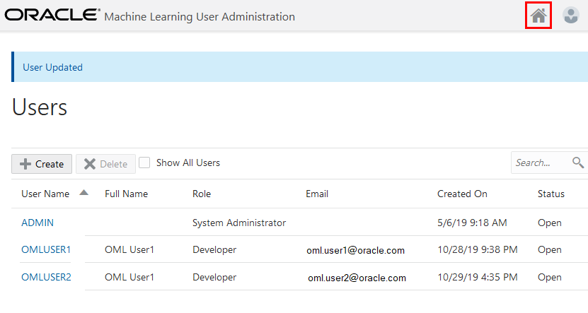

2.  Sign in to OML using your new user account, **omluser1**:

    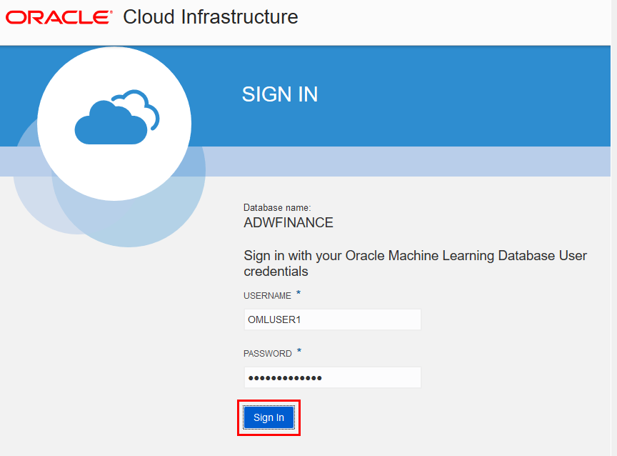

3.  Once you have successfully signed in to OML, the application home page will be displayed. The grey menu bar at the top left corner of the screen provides links to the main OML menus. The project/workspace and user maintenance menus are at the top right corner.

    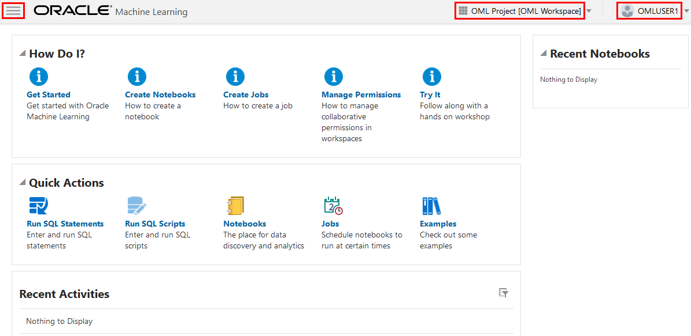

4.  On the home page, the main focus is the “**Quick Actions**” panel. The main icons in this panel provide shortcuts to the main OML pages for running queries and managing your saved queries.

    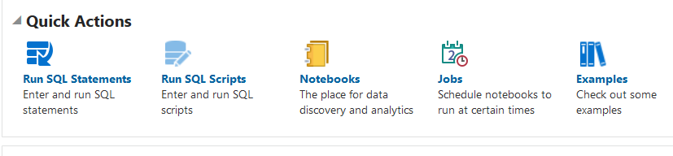

5.  All of your work is automatically saved –  there is no “Save” button when you are writing scripts and/or queries.

## **STEP 2**: Opening a New SQL Query Scratchpad to Run a SQL Statement

1.  From the home page, click the “**Run SQL Statements**” link in the Quick Actions panel to open a new SQL Query Scratchpad.

    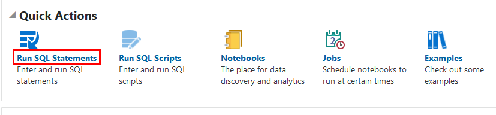

2.  The following screen should appear.

    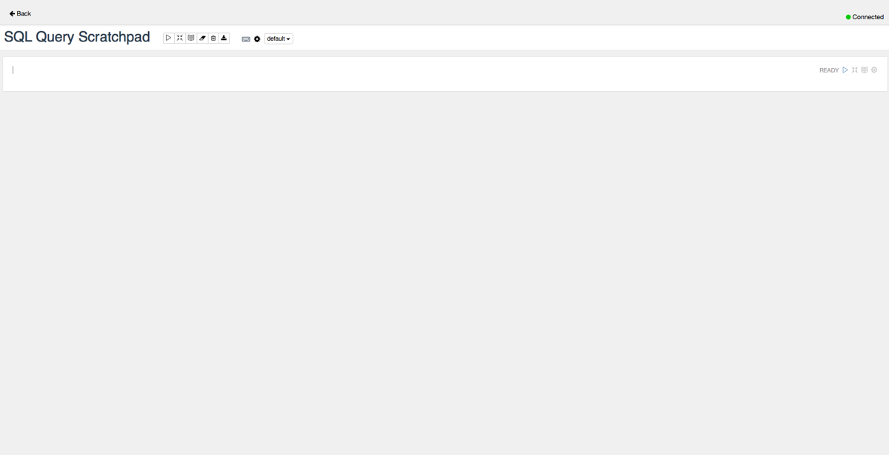

3.  The white panel below the main title (SQL Query Scratchpad – this name is automatically generated) is an area known as “paragraph”. Within a scratchpad, you can have multiple paragraphs. Each paragraph can contain one SQL statement or one SQL script.

    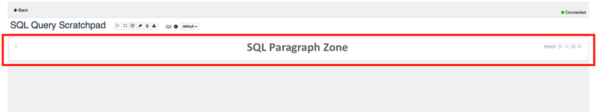

4.  In the SQL paragraph area, copy and paste <a href="./files/new_SQL_query_scratchpad.txt" target="\_blank">this code snippet</a>. Your screen should now look like this:

    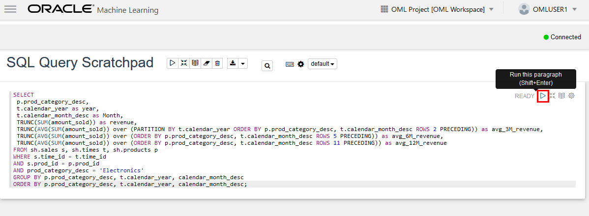

5.  Press the icon shown in the red box to execute the SQL statement and display the results in a tabular format.

    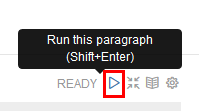

    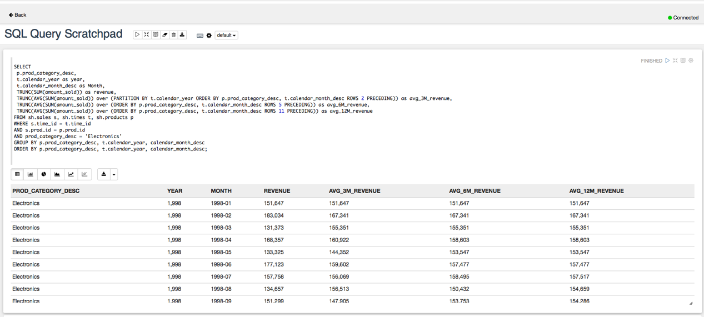

## **STEP 3**: Creating Time-aggregated data for Transactions

## **STEP 4**: Saving the Scratchpad as a New Notebook

The SQL Scratchpad in the previous section is simply a default type notebook with a system generated name. But we can change the name of the scratchpad we just created, **SQL Query Scratchpad**.

1.  Click on the **Back** link in the top left corner of the Scratchpad window to return to the OML home page.

    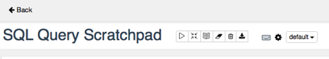

2.  Notice that in the **Recent Activities** panel, there is a potted history of what has happened to your SQL Query Scratchpad “notebook”.

    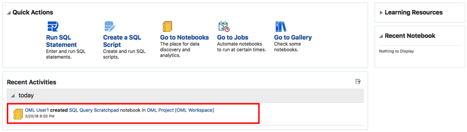

3.  Click **Go to Notebooks** in the **Quick Actions** panel.

    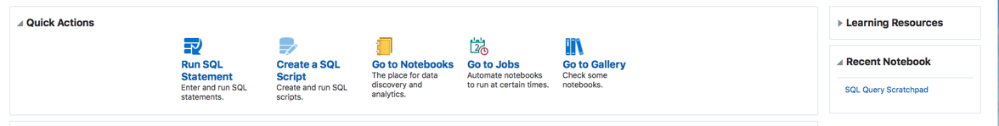

4.  The **Notebooks** page will be displayed:

    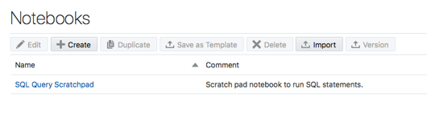

5.  Let’s rename our SQL Query Scratchpad notebook to something more informative. Click on text in the **comments** column to select the scratchpad, so that we can rename it. After you click, the “SQL Query Scratchpad” will become selected, and the menu buttons above will be activated.

  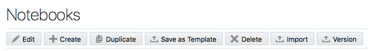

  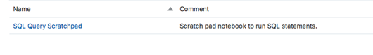

6.  Click the **Edit** button to pop-up the *Edit Notebook* dialog for this notebook, and enter the information as shown in the image below. *Note that the Connection information is read-only, because this is managed by Autonomous Data Warehouse.*

    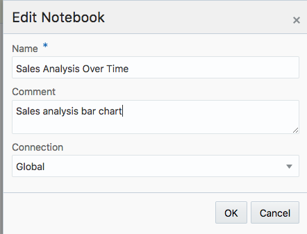

7.  Click **OK** to save your notebook. You will see that your SQL Query Scratchpad notebook is now renamed to the new name you specified.

    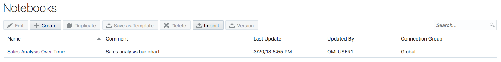

## Want to Learn More?

Click [here](https://docs.oracle.com/en/cloud/paas/autonomous-data-warehouse-cloud/user/create-dashboards.html#GUID-56831078-BBF0-4418-81BB-D03D221B17E9) for documentation on creating dashboards, reports, and notebooks with Autonomous Data Warehouse.

## **Acknowledgements**

- **Author** - Nilay Panchal, ADB Product Management
- **Adapted for Cloud by** - Richard Green, Principal Developer, Database User Assistance
- **Last Updated By/Date** - Arabella Yao, Product Manager Intern, DB Product Management, July 2020

