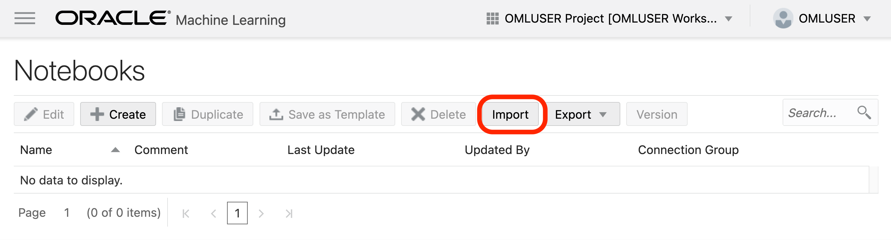
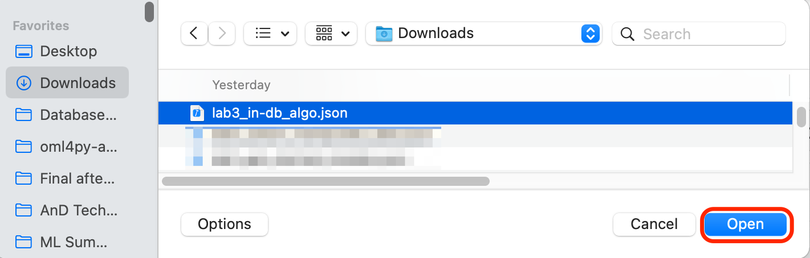
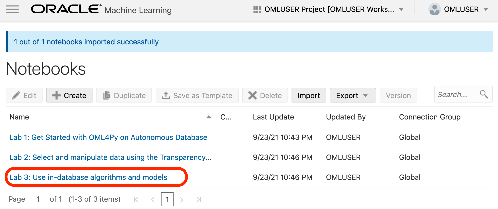
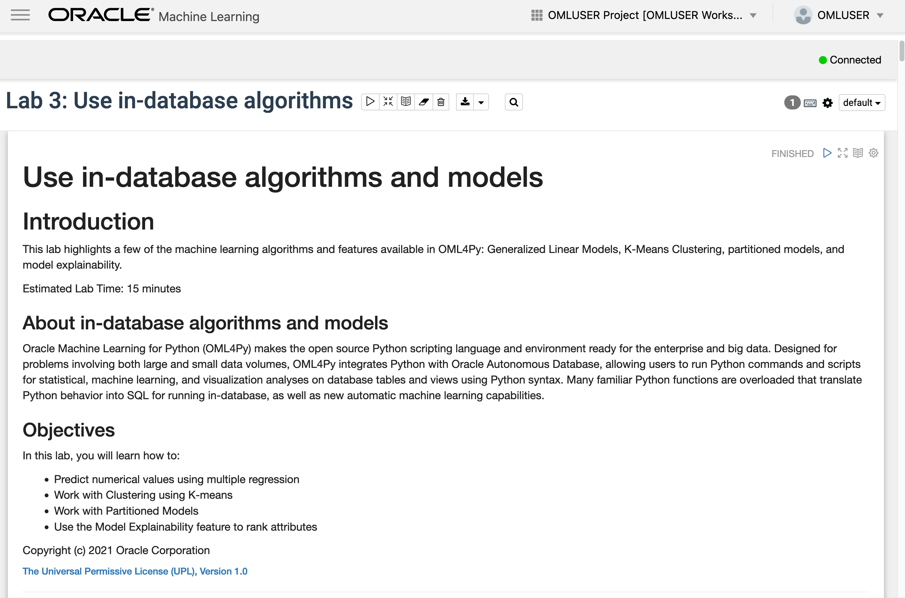
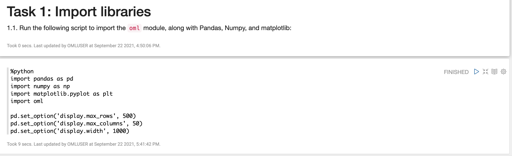
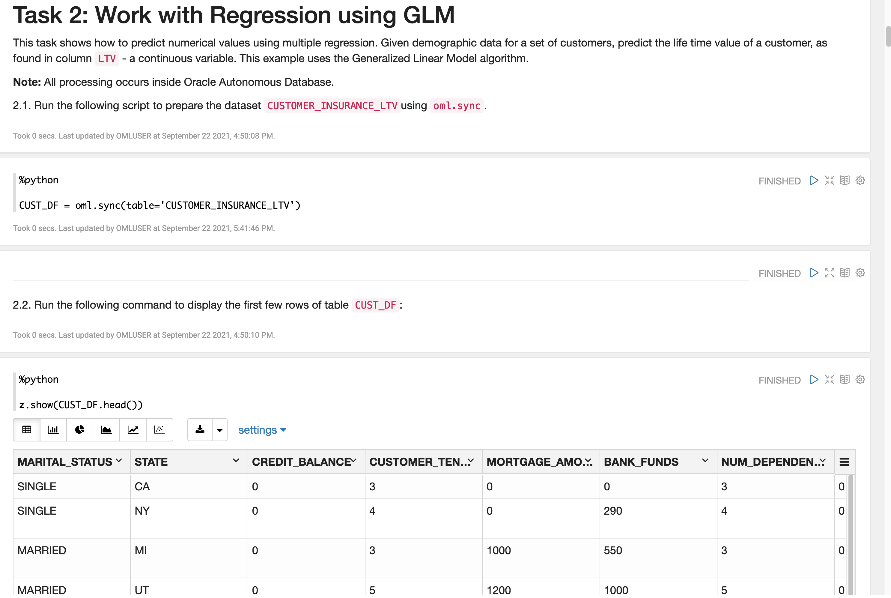
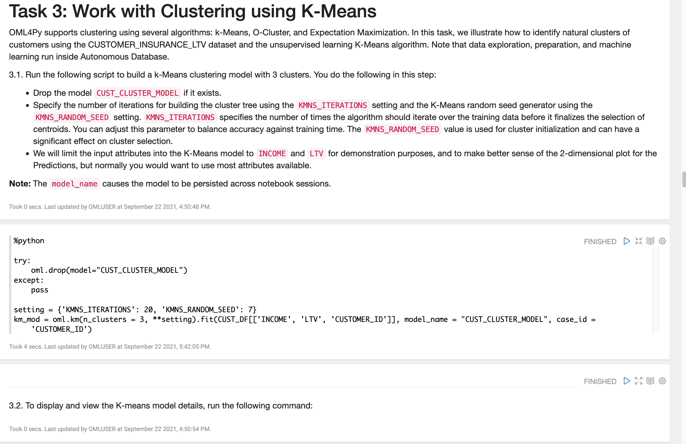
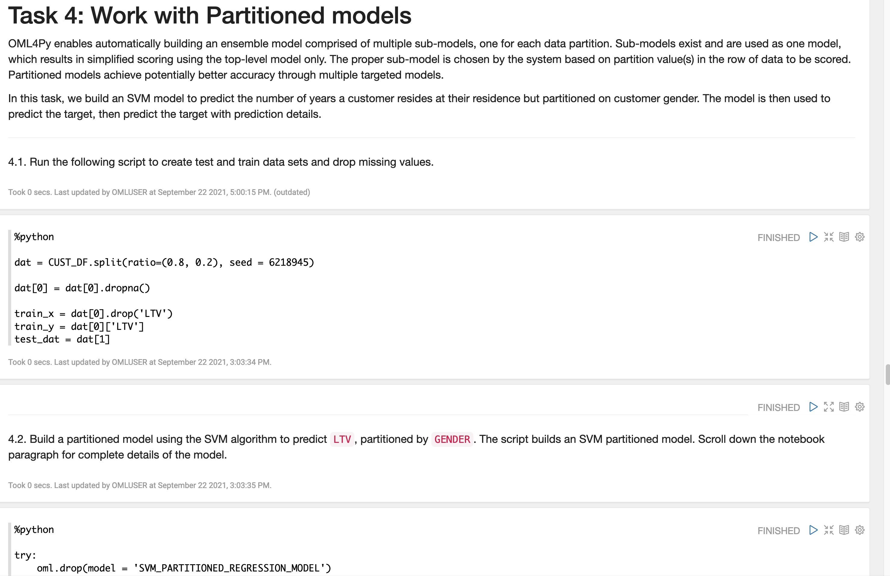
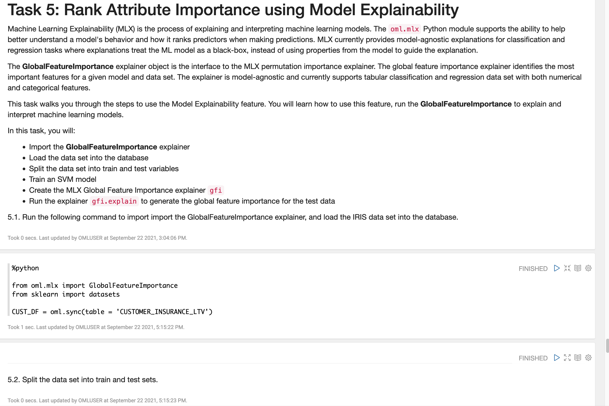

# Use in-database algorithms and models

## Introduction
This lab highlights a few of the machine learning algorithms and features available in OML4Py: Generalized Linear Models (GLM), K-Means Clustering, partitioned models, and model explainability.

Estimated Lab Time: 15 minutes

### About in-database Algorithms and Models
The in-database parallelized machine learning algorithms are exposed through a natural Python interface. A range of machine learning techniques are supported, including classification, regression, clustering, attribute importance, anomaly detection, association rules, and feature extraction. With OML4Py, users can build more models on more data, and score large volume data – faster – taking advantage of Autonomous Database optimizations – including auto-scale. Data Scientists benefit from automatic data preparation, partitioned model ensembles, and integrated text mining. This can result in increased productivity for data scientists, while at the same time, the powerful in-database algorithms are made more accessible to non-expert users.

The in-database, parallelized algorithms keep data under database control – no need to extract data to separate machine learning engines, which can be time-consuming and introduces issues of data security, storage, and currency. In-database algorithms are fast and scalable, enable batch and real-time scoring, and provide explanatory prediction details, so you can understand why an individual prediction is made. This is the core of the “bring the algorithms to the data“ tagline.

In-database machine learning models are first-class objects in Oracle Database. You can control access by granting and revoking permissions, audit user actions, and export and import machine learning models across databases. In-database models produced through the Python API can also be accessed using the SQL API.

### Objectives

In this lab, you will learn how to:
* Predict numerical values using multiple regression
* Work with clustering using K-means
* Work with partitioned models
* Use the Model Explainability feature to rank attributes

## Download the notebook file for this Lab

1. [**CLICK HERE** to download the lab3\_in-db\_algo.json notebook file](./../notebooks/lab3_in-db_algo.json?download=1). This will download the notebook file for this lab to your local machine. 

2. Go back to the main notebooks listing by clicking on the "hamburger" menu (the three lines) on the upper left of the screen, and then select **Notebooks**.

 

3. Click the **Import** button.  

 

4. Select the `lab3_in-db_algo.json` notebook file and click **Open**.
   
 

- After the notebook is successfully imported, click the **notebook name** to view it.
   

   OML Notebooks will create a session and make the notebook available for editing.

   You can optionally click the **Run all paragraphs** () icon, and then click **OK** to confirm to refresh the content with your data, or just scroll down and read the pre-recorded results.  
   
   

## Task 1: Import Libraries

Follow the flow of the notebook by scrolling down from the right to visualize each step of each task of this lab.

Scroll down to the beginning of Task 1.

    

## Task 2: Work with Regression Using Generalized Liner Model (GLM)

Follow the flow of the notebook by scrolling down from the right to visualize each step of each task of this lab.

Scroll down to the beginning of Task 2.

   

## Task 3: Work with Clustering Using K-Means
Follow the flow of the notebook by scrolling down from the right to visualize each step of each task of this lab.

Scroll down to the beginning of Task 3.

   

## Task 4: Work with Partitioned Models

Follow the flow of the notebook by scrolling down from the right to visualize each step of each task of this lab.

Scroll down to the beginning of Task 4.

   

## Task 5: Rank Attribute Importance using Model Explainability

Follow the flow of the notebook by scrolling down from the right to visualize each step of each task of this lab.

Scroll down to the beginning of Task 5.

   

## Learn More

* [About Machine Learning Classes and Algorithms](https://docs.oracle.com/en/database/oracle/machine-learning/oml4py/1/mlpug/about-machine-learning-algorithms.html#GUID-00F8AF8F-6652-4161-BEEF-E737A68FB53C)
* [Oracle Machine Learning Notebooks](https://docs.oracle.com/en/database/oracle/machine-learning/oml-notebooks/)

## Acknowledgements
* **Authors** - Marcos Arancibia, Product Manager, Machine Learning; Moitreyee Hazarika, Principal User Assistance Developer
* **Contributors** -  Mark Hornick, Senior Director, Data Science and Machine Learning; Sherry LaMonica, Principal Member of Tech Staff, Machine Learning
* **Last Updated By/Date** - Marcos Arancibia, September 2021
