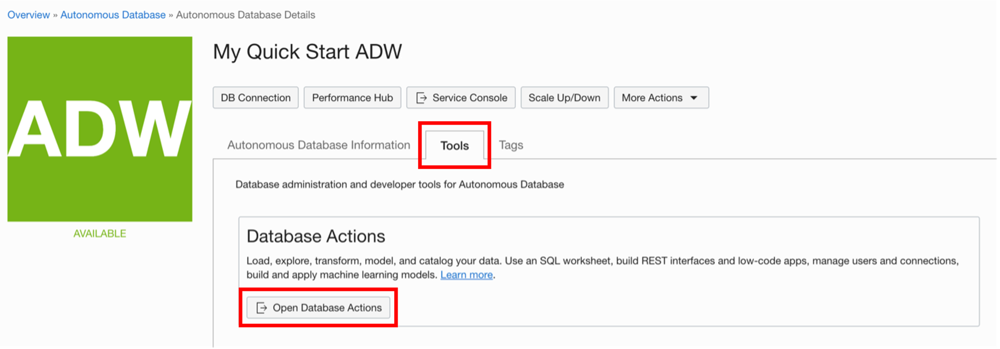
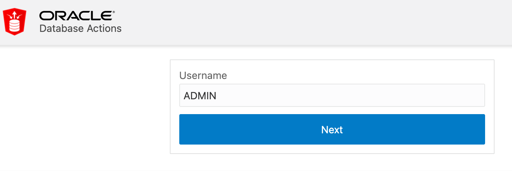
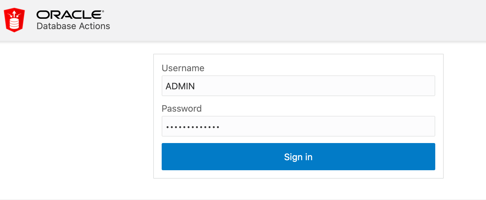
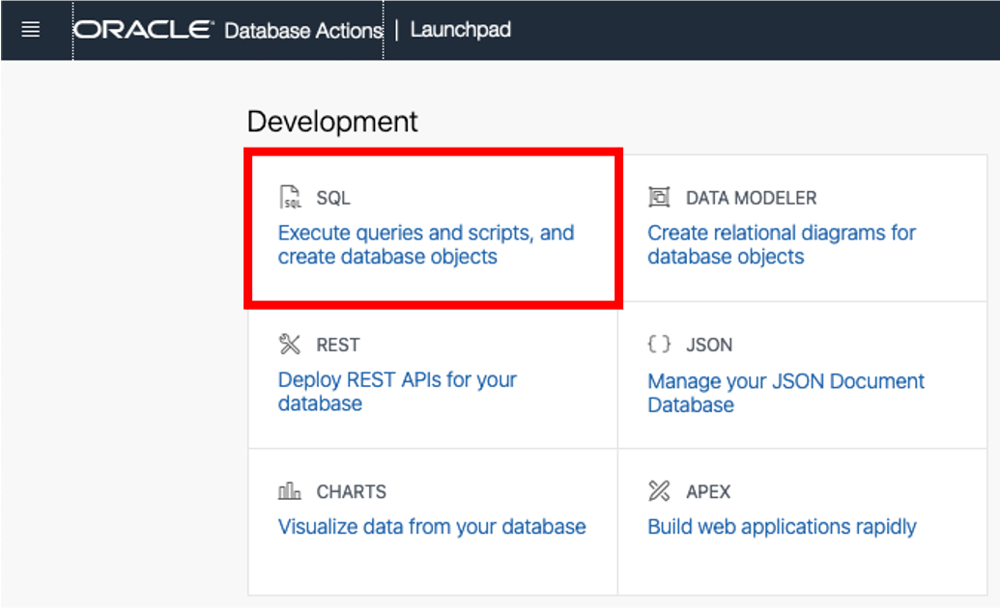
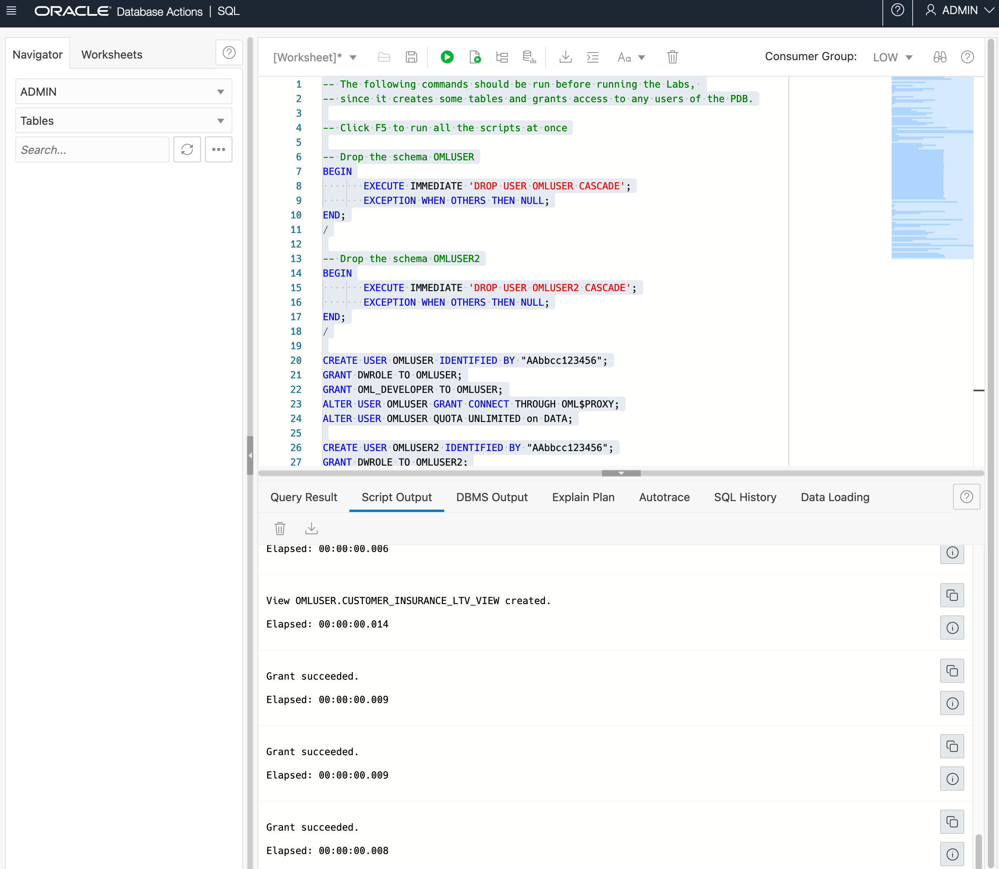

# Run the prerequisites for the labs

## Introduction
The workshop assumes that an Oracle Machine Learning user named **`OMLUSER`** has been created and configured for signing into OML Notebooks and running all labs. 

A second user named **`OMLUSER2`** is also needed for the appropriate demonstration of the permission grants to OML4Py Datastore and Script Repository from one user to another.

**IMPORTANT:** These users <span style="color:red">are not available</span> by default in any Autonomous Database tenancy.  

Please follow the steps below to make sure you have these users created in your tenancy, as that the sample data is loaded prior to running any labs.

The SQL scripts will drop and recreate the OMLUSER and OMLUSER2 user schemas.  This means that all of the data for those users will be deleted and recreated.

>**<span style="color:red">Warning:</span>  Any work and Notebooks that might have been stored previously by OMLUSER or OMLUSER2 users (if you had created them before) will be deleted - so save your work!**

Estimated Time: 10 minutes

## Task 1:  Connect to Autonomous Database Actions as the ADMIN User

Connect to Autonomous Database Actions as the ADMIN user:

1. In your Autonomous Database details page, click the Tools tab. Click **Open Database Actions**.

    

2. On the login screen, enter the username ADMIN, then click the blue **Next** button.
   
    

3. In the next screen, enter ADMIN and the password for the ADMIN user you set up when you provisioned your Autonomous Database instance. Then click the blue **Sign in** button. 
   
    

4. Open the SQL Worksheet from the Launchpad:

    

    You are now ready to enter the SQL code. Proceed to the next task.

## Task 2:  Create the Autonomous Database users that are a prerequisite for the labs

Now that you're in the SQL worksheet, you will run the code that will initialize the users required by the workshop.  

1. Copy the script below into the worksheet and click Run Script (F5).

  ```
  <copy>
  -- The following commands should be run before running the labs, 
  -- since it creates the OML users required to 
  -- sign-in to OML Notebooks 

  -- Click F5 to run all the scripts at once

  -- Drop the schema OMLUSER
  BEGIN
         EXECUTE IMMEDIATE 'DROP USER OMLUSER CASCADE';
         EXCEPTION WHEN OTHERS THEN NULL;
  END;
  /  

  -- Drop the schema OMLUSER2
  BEGIN
         EXECUTE IMMEDIATE 'DROP USER OMLUSER2 CASCADE';
         EXCEPTION WHEN OTHERS THEN NULL;
  END;
  /

  CREATE USER OMLUSER IDENTIFIED BY "AAbbcc123456";
  GRANT DWROLE TO OMLUSER;
  GRANT OML_DEVELOPER TO OMLUSER;
  ALTER USER OMLUSER GRANT CONNECT THROUGH OML$PROXY;
  ALTER USER OMLUSER QUOTA UNLIMITED on DATA;

  CREATE USER OMLUSER2 IDENTIFIED BY "AAbbcc123456";
  GRANT DWROLE TO OMLUSER2;
  GRANT OML_DEVELOPER TO OMLUSER2;
  ALTER USER OMLUSER2 GRANT CONNECT THROUGH OML$PROXY;
  ALTER USER OMLUSER2 QUOTA UNLIMITED on DATA;

  </copy>
  ```

2. The result of running the SQL steps is displayed in the bottom section of the screen, (the Script Output), as shown below .

 

 The code is expected to run in a few seconds, depending on your tenancy. 
 Once completed, users OMLUSER and OMLUSER2 are initialized and you can continue to "Lab 1: Getting Started with OML4Py".

## Acknowledgements

* **Author** - Marcos Arancibia, Product Manager, Machine Learning
* **Last Updated By/Date** - Marcos Arancibia, September 2021
