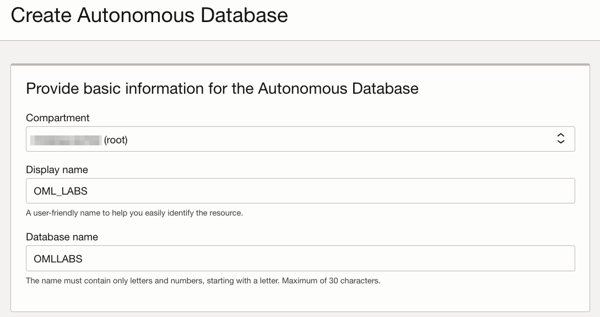
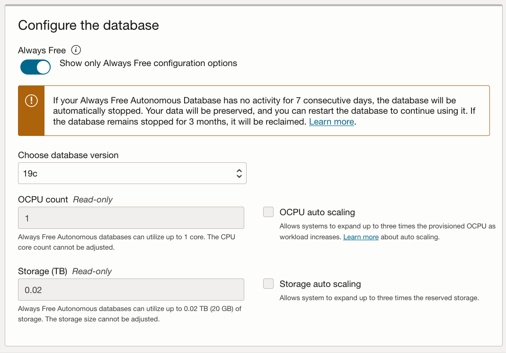
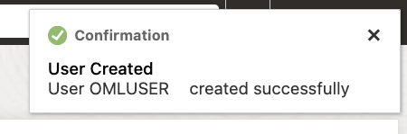

# Get started with Oracle Cloud Free Tier Setup

## Introduction

This lab walks you through the steps to set up your Oracle Cloud Free Tier environment that includes provisioning an Oracle Autonomous Database, and signing into Oracle Machine Learning user interface.

Estimated Time: 15 minutes

### Objectives

In this lab, you will learn how to:

* Provision an Oracle Autonomous Database
* Create an Oracle Machine Learning user
* Sign into Oracle Machine Learning user interface

### Prerequisites

* Sign up for a Free Tier Oracle Cloud account.

> **Note:** You may see differences in account details (eg: Database Name is different than yours) as you work through the labs. This is because of the flexibility of choice you will have when creating your own.

## Task 1: Provision an Oracle Autonomous Database

To provision an Oracle Autonomous Database:

1. Sign into your OCI account, and under the Launch Resources section, click **Create an ADW database**.

	

	 Alternatively, you may click the left navigation pane on the upper left corner, and click **Autonomous Data Warehouse** under **Oracle Database**.

	

2. From the Oracle Cloud Infrastructure console, on the Oracle Autonomous Database page choose your region and select a compartment. Click **Create Autonomous Database**. This opens the Create Autonomous Database page.

> **Note:** You will need to make sure to select your Home Region if you intent on creatng an Always-Free Autonomous Database.

   

3. On the Create Autonomous Database page, provide the basic information about the database. By default, a database name and a display name for the database are provided. You can modify these names to enter a user-friendly display name for the ADB instance to easily identify the resource. The display name does not have to be unique.    

   

4. For Workload Type, click **Data Warehouse**.

	 

5. For Deployment, select **Shared Infrastructure**.

	 

6. For Database Configuration, select Always Free. For the Always Free option, the database configuration options - OCPU count, Storage, and OCPU auto scaling nor Storage auto scaling are available. You must upgrade to a paid account to be able to choose it.

	 > **Note:** You can create Always Free resources both in Free Tier and Paid accounts

  

7. Create your Autonomous Database administrator credentials by providing a password. You will need these credentials to sign into this Autonomous Database instance.   

	> **Note:** The default administrator username is ADMIN. The ADMIN password must be 12 to 30 characters and contain at least one uppercase letter, one lowercase letter, and one number. The password cannot contain the double quote (") character or the username "admin".

	

8. For network access, select **Allow secure access from everywhere.**

    

9. For License, select **License Included**.

    

10. Provide your email ID for any notifications and announcements, and click **Add Contact**. Then click **Create Autonomous Database**.

	 

	 The Oracle Autonomous Data Warehouse instance starts provisioning. Once your Autonomous Database is created, the database details are listed with the status Available.

	  

This completes the task of provisioning an Oracle Autonomous Database.

## Task 2: Create an Oracle Machine Learning user

An administrator creates a new user account and user credentials for Oracle Machine Learning in the Database Users user management interface.

> **Note:** You must have the administrator role to access the Database Actions Database Users interface.

To create a user account:

1. Sign into your OCI account, click the hamburger on the left to open the left navigation pane, and click **Oracle Database**. On the right, click **Autonomous Data Warehouse**.

	

2. The Autonomous Database dashboard lists all the databases that are provisioned in the tenancy. Click the Oracle Autonomous Database that you have provisioned.  

	

3. On the Autonomous Database details page, click **Database Actions**.

	

4. The Oracle Database Actions Launchpad page opens in a separate tab. Scroll down to the Administration section and click **DATABASE USERS**.
   
	> **Note:** You might be asked for a user and password at this point, depending on your browser. If asked, make sure to enter **ADMIN** and the password you gave the administrator user in Task 1, Step 7.

	

5. Click **Create User**. The Create User dialog opens.

	

6. On the Create User dialog, enter the following details and click **Create User**:	  

	

	* **User Name:** Enter the user name OMLUSER.
	* **Password:** Enter a password for this user. The password must be 12 to 30 characters and contain at least one uppercase letter, one lowercase letter, and one number. The password cannot contain the double quote (") character or the username itself.
	* **Confirm Password:** Re-enter the password that you entered in the Password field.
	* **Graph:** Select this option to enable graph for this user.
	* **Web Access:** Select this option to allow Web and DB Actions access to this user.
	* **OML:** Select this option to allow this user to access Oracle Machine Learning.
	* **Quota of tablespace data:** Click on the drop-down list and select an option. For this lab, 1G is selected.
	* **Password Expired:** Select this option if you want the user to reset the password.
	* **Account is locked:** Select this option to lock the account.

7. After the user is created successfully, the message _User OMLUSER created successfully_ is displayed.

	

	Scroll down the page to view the user. The OMLUSER is listed along with all details. Click  to edit, delete, or disable any of the privileges granted to the user.
	

	This completes the task of creating a user.

## Task 3: Sign into Oracle Machine Learning

A notebook is a web-based interface for data analysis, data discovery, data visualization, and collaboration. You create and run notebooks in Oracle Machine Learning user interface. You can access Oracle Machine Learning user interface from Autonomous Database.

1. On your Oracle ADW instance, click **Database Actions**.

	

	 If you had it already open in the Database Users section, you can go to Database Actions home page clicking in the **Database Actions** on the top left corner of the page, as shown in the screenshot below.

	

2. On the Database Actions page, go to the Development section and click **Oracle Machine Learning**. This opens the Oracle Machine Learning sign in page.

	 

3. Enter your user credentials and click **Sign in**.

	> **Note:** The credential is what you have defined while creating the Oracle Machine Learning user.

	

  This opens the Oracle Machine Learning user interface home page.

	

This completes the task of signing into Oracle Machine Learning user interface.

## Learn More

* [Get Started with Oracle Machine Learning for Python](https://docs.oracle.com/en/database/oracle/machine-learning/oml4py/1/mlpug/get-started-with-oml4py.html#GUID-B45A76E6-CE48-4E49-B803-D25CA44B09ED)
* [Oracle Machine Learning Notebooks](https://docs.oracle.com/en/database/oracle/machine-learning/oml-notebooks/)

## Acknowledgements

* **Author** - Moitreyee Hazarika, Principal User Assistance Developer, Database User Assistance Development
* **Contributors** -  Mark Hornick, Senior Director, Data Science and Machine Learning; Marcos Arancibia Coddou, Product Manager, Oracle Data Science; Sherry LaMonica, Principal Member of Tech Staff, Advanced Analytics, Machine Learning
* **Last Updated By/Date** - Marcos Arancibia, March 2023
